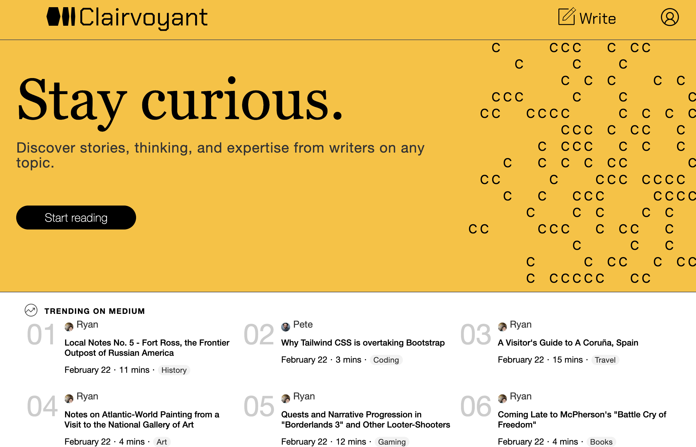

# README

Clairvoyant is a full stack clone of Medium, a popular blog host with a mix of amateur and professional journalism. It allows users to post articles and read other users' articles. Users can comment, post, like, bookmark, and share as well. Articles and comments have full CRUD functionality, and users can search articles and filter by topic.


<p>Live link: <a href="https://www.freecodecamp.org/" target="_blank" rel="noopener noreferrer">Clairvoyant</a></p>



## Clairvoyant Stack:
* Backend: Ruby on Rails
  * Used for models, controllers, routes
  * Pases data to frontend via JBuilder/JSON
* Database: PostgreSQL
  * Connected to backend via a rails framework
* Image Hosting: AWS
  * Article images [and user icons] are stored on S3
* Frontend: Javascript + React/Redux
  * Written in Javascript
  * Uses React to render components and Redux for state management
* Libraries
  * React Quill
  * Interweave

## Installation
1. Clone the repository: git clone https://github.com/1banni/clairvoyant.git
2. Install the dependencies
  * From the root directory, run `bundle install`
  * From the frontend directory, run `npm install`
3. Seed and configure the database with rails commands using `seeds.rb` file
  * You'll need to have PostgreSQL installed and running
4. Run the application
  * From the root directory, run `rails server`
  * From the frontend, run `npm start`
  * In development mode, the frontend is served up on port 3000 and the backend on 5000
  * In production mode, the app is served on port 500

Production build: from the root folder, run `npm run build`

## Selected Features and Development
### Create Article
Article creation utilizes FileReader and two useState arrays to let users load multiple image files.
```
  const handlePhotos = async e => {
    const files = Array.from(e.target.files);

    if (files) {
      files.forEach(file => {
        const fileReader = new FileReader();
        fileReader.readAsDataURL(file);
        fileReader.onload = () => {
          // setPhotoFiles(prev => prev.push(file));
          // setPhotoUrls(prev => prev.push(fileReader.result));
          setPhotoFiles(prev => [...prev, file]);
          setPhotoUrls(prev => [...prev, fileReader.result]);
        };
      });
    }
  };
```
The app combines React Quill and Interweave libraries to enable rich text editing and display.
```
<div className='pair'>
  <div className={`label blurb ${active(blurb)}`}>Blurb</div>
  <input label=''
      className='input blurb'
      type='text'
      value={blurb}
      onChange={blurbChange}
      placeholder='Up to 120 characters (optional)'
      maxlength='120'
    />
</div>

<div className='pair body'>
  <div className={`label body ${active(body)}`}>Body</div>
  <ReactQuill theme='snow'
              modules={modules}
              formats={formats}
              value={body}
              onChange={setBody}
              id='reactquill'>
  </ReactQuill>
</div>
```
The inputs are sent to the backend in a FormData object. The photos are attached via Rails Active Storage and uploaded to AWS. Catch blocks are used to store error messages from the backend which are then displayed on the frontend.
```
  const handleSubmit = async e => {
    e.preventDefault();
    if (!sessionUser) return ModalUtil.open(LoginModal);

    const formData = new FormData();
    formData.append('article[title]',title);
    formData.append('article[topic]',topic);
    if (blurb) formData.append('article[blurb]',blurb);
    formData.append('article[body]',body);

    if (photoFiles?.length > 0) {
      photoFiles.forEach(photo => {
        formData.append('article[photos][]',photo);
      });
    }

    if (formType === 'Create') {
        articleId = dispatch(createArticle(formData))
        .catch( async res => {
          let data;
          try {
            data = await res.clone().json();
          } catch {
            data = await res.text();
          }

          if (data?.errors) setErrors(data.errors);
          else if (data) setErrors([data]);
          else setErrors([res.statusText]);
        })
      if (articleId) {
        clearForm();
        history.push(`/articles/${articleId}`);
      }
    } else {
      dispatch(updateArticle(formData, articleId))
        .catch( async res => {
          let data;
          try {
            data = await res.clone().json();
          } catch {
            data = await res.text();
          }

          if (data?.errors) setErrors(data.errors);
          else if (data) setErrors([data]);
          else setErrors([res.statusText]);
        })
        .then(history.push(`/articles/${articleId}`));
    }
  }

```
### Bookmarks & Claps
Users can applaud and bookmark articles and view bookmarked articles on the profile page. Icons for both toggle based on whether the user has applauded/bookmarked a specific post.
```
const Bookmark = ({articleId, options}) => {
  options ||= {fill: 'black', size:'20px' };
  const dispatch = useDispatch();
  const sessionUser = useSelector(state => state.session.user);
  const bookmark = useSelector(state => state.bookmarks[articleId]);

  let BookmarkIcon = bookmark
    ? <MdOutlineBookmark className='icon bookmark' style={options}/>
    : <MdOutlineBookmarkAdd className='icon bookmark' style={options}/>;

  const toggleBookmark = async e => {
    e.preventDefault();

    if (!sessionUser) ModalUtil.open(LoginModal);

    if (bookmark) {
      dispatch(deleteBookmark(bookmark));
    } else {
      dispatch(createBookmark({
        user_id: sessionUser.id,
        article_id: articleId
      }));
    }
  };

  return (
    <Button className='icon-btn bookmark'
            containername='icon-btn-ctnr bookmark'
            onClick={toggleBookmark}>
      {BookmarkIcon}
    </Button>
  );
};

export default Bookmark;
```


### Custom Hooks
#### useStateChange
Wraps useState with an event handler for capturing text input.
```
const useStateChange = (initialValue) => {
  // Initialize useState
  const [value, setValue] = useState(initialValue);
  // Create changeHandler for input form
  const handleValue = e => {
    setValue(e.target?.value);
  }

  return [value, setValue, handleValue];
}

export default useStateChange;
```
#### useSubmit
```
import { useState } from 'react';
import { useDispatch } from 'react-redux';

const useSubmit = ({createAction, onSuccess}) => {
  const dispatch = useDispatch();
  let [errors, setErrors] = useState([]);

  const handleSubmit = async e => {
    e.preventDefault();

    setErrors([]);
    return dispatch(createAction())
      .catch(async res => {
          let data;
          try { data = await res.clone().json(); }
          catch { data = await res.text(); }

          if (data?.errors) setErrors(data.errors);
          else if (data) setErrors([data]);
          else setErrors([res.statusText]);
      })
      .then(onSuccess)
  }

  return [errors, handleSubmit];
};

export default useSubmit;

```

### Reusable Components
#### Buttons
All buttons in the app are built using the Button class below, which provides default classNames for styling and the ability to open modals with the button.
```
import React from 'react';
import ModalUtil from '../../context/ModalUtil';
import './Button.css';

const Button = ({children, containername, label, redirect, modal, ...props}) => {
  // Defaults:
  containername ||= 'btn-ctnr';
  props.className ||= 'btn';
  props.type ||= 'button';
  if (modal) props.onClick = () => ModalUtil.open(modal, redirect);

  return (
    <div className={containername}>
      <button {...props}>
        {label}
        {children}
      </button>
    </div>
  );
};

export default Button;
```
#### Tile Components
Since the website has many different article tiles that show various bits of information about articles, I seperated the items that can be displayed on a tile into individual components, such as Author, Detail, and ReadTime. These building blocks are used in different combinations for different article tiles around the app.
```
const ArticleAuthor = ({user, name, children, photoURL, imageId, ...props}) => {
  const styleOptions = {
    stroke: ColorUtil.nameToColor(name),
    fill: 'white',
    strokeWidth: '50'
  }

  return (
    <div className='user-name-icon-ctnr'>
      <div className='user-icon-ctnr'>
      {photoURL
      ? <Image url={photoURL} alt={photoURL}
          className='image icon'
          wrapper='image-wrapper icon'
        />
      : <FaUserCircle
          style={styleOptions}
      />}
      </div>

      <div className='user-name'>
        {name || user.name}
      </div>

      {children}
    </div>
  )
}
```
#### Tooltips
```
import React, { useState } from 'react';
import './Tooltip.css';

const Tooltip = ({label, buttonname, className, timeout, ...props}) => {
  const [active, setActive] = useState(false);
  buttonname ||= 'tooltip-btn';
  className ||= 'tooltip bottom';

  const toggleTooltip = () => {
    if (active) setActive(false);
    else {
      setActive(true)
      if (timeout) {
        setTimeout(() => {
          setActive(false);
        }, timeout)
      }
    }
  }

  return (
    <div>
      <div className={buttonname} onClick={toggleTooltip} >
        {label}
      {active && (
        <div className={className}>
          {props.content}
          {props.children}
        </div>
      )}
      </div>
    </div>
  );
};

export default Tooltip;
```


### Animation
The splash page animation uses an array of integers ranging from 0 to 30. A counter ticks from 1 to 30 back and forth, and any spaces in the array with a number below the counter are shown.
```
const SplashAnimation = () => {
  const grid = mAnimatedGrid;
  const [count, setCount] = useState({ tick: 1, dir: 1 });

  useEffect(() => {
    const interval = setInterval(() => {
      const ceil = 30;
      const floor = 3;
      setCount(prev => {
        if (prev.tick > ceil) {
          return {tick: ceil, dir: -1}
        } else if (prev.tick < floor) {
          return {tick: floor, dir: 1};
        } else {
          const nextTick = prev.tick + prev.dir
          return {tick: nextTick, dir: prev.dir}
        }
      });
    }, 50);

    return () => {
      clearInterval(interval);
    }
  }, []);


  return (
    <div className='splash-animation-container'>
      <div className='splash-animation'>
        {AnimationUtil
          .convertToC(grid, count.tick)
          .map((row, rowIdx) =>
            row.map((el, colIdx) => {
              return <div key={rowIdx + '~' + colIdx} className='splash-animation-el'>{el}</div>
        }))}
      </div>
    </div>
  );
};
```

### Active Record
Rails Active Record associations are used to fetch related records from multiple database tables.
```
class Article < ApplicationRecord
  validates :title, :author_id, :topic, :body, presence: true

  belongs_to :author, class_name: :User, foreign_key: :author_id

  has_many_attached :photos

  has_many :claps, dependent: :destroy
  has_many :bookmarks, dependent: :destroy
  has_many :comments, dependent: :destroy

  has_many :clappers, through: :claps, source: :user
  has_many :bookmarkers, through: :bookmarks, source: :user
  has_many :commenters, through: :comments, source: :user
end
```
